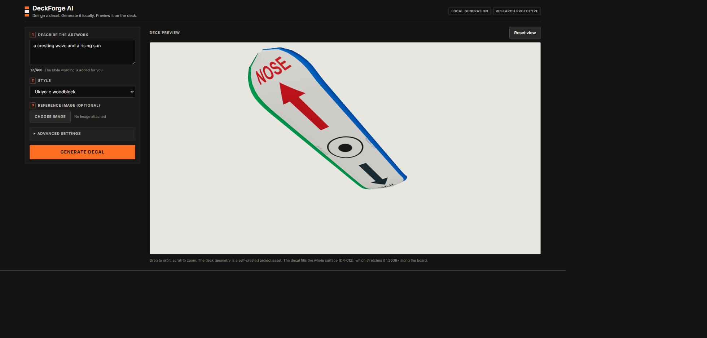
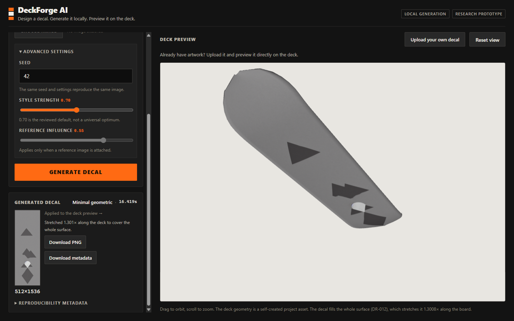
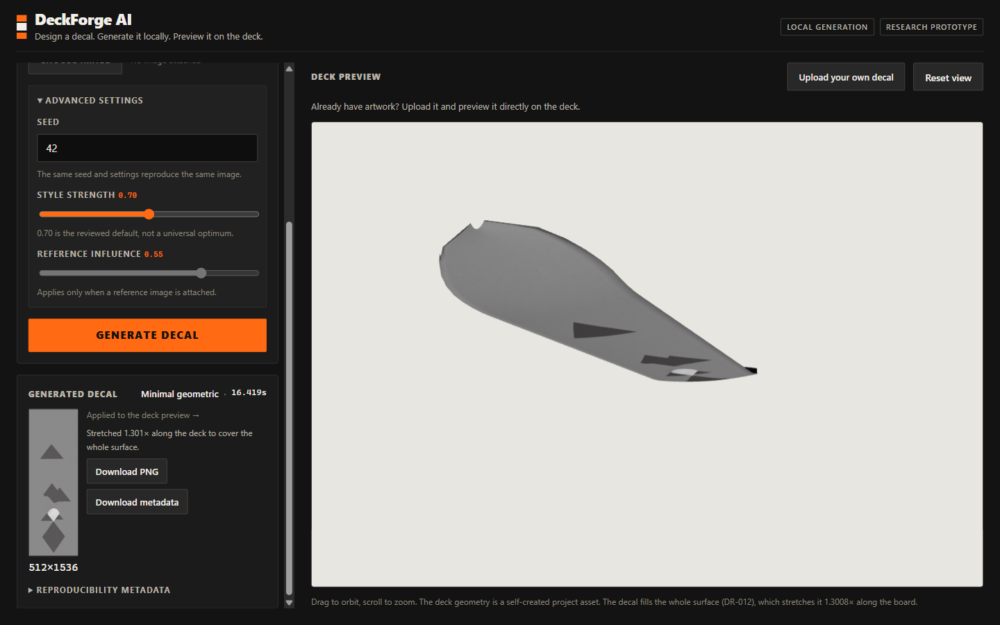
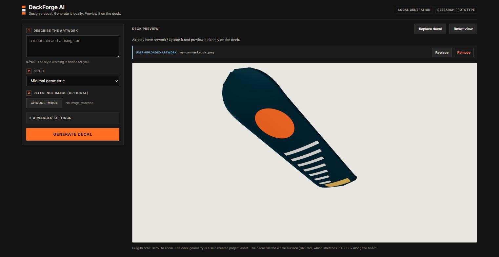
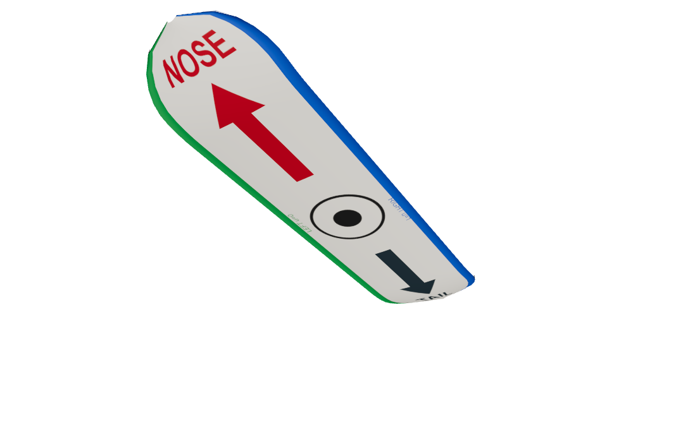
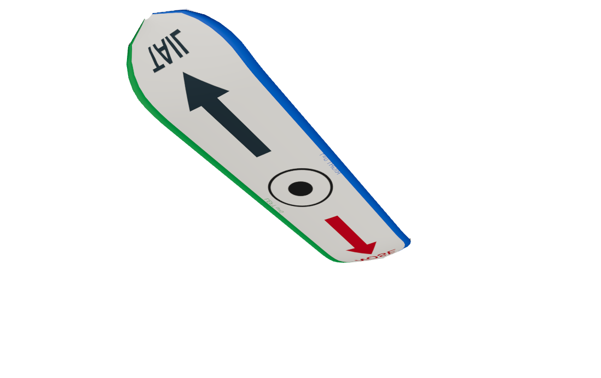
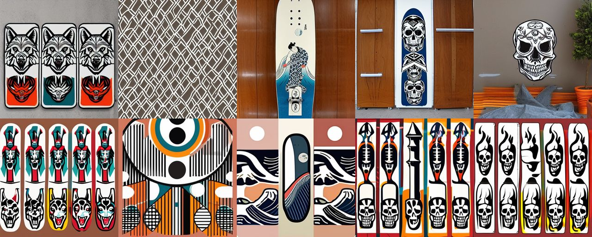
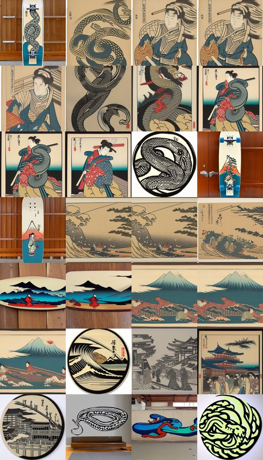
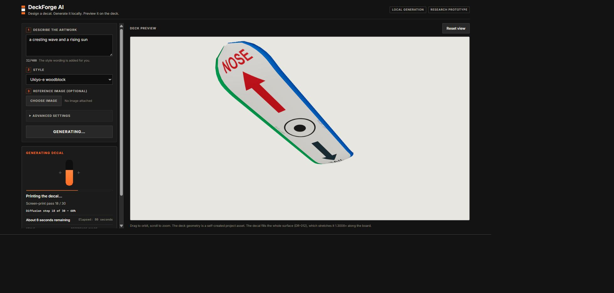
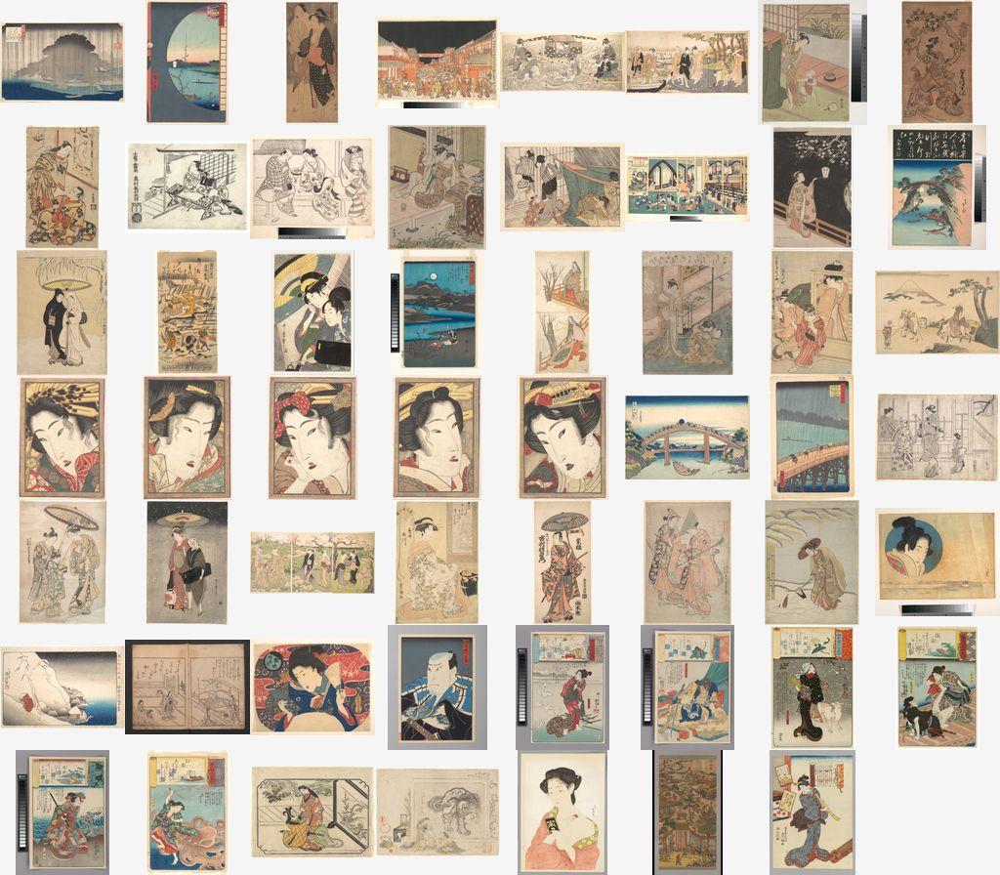

# DeckForge AI

**A self-trained, locally deployed AI skateboard-decal generator.**
Final bachelor resit assignment, Multimedia & Creative Technologies (Erasmushogeschool Brussel) —
Kylian Algoet.

> **This README is the prototype documentation for the submission.** It documents what was built,
> how it evolved, what was compared, what failed, and where the code and evidence live. The full
> written research is the PDF linked below.
>
> 📄 **[Full research documentation (PDF, 91 pages)](deliverables/DeckForge-AI-research-report.pdf)**
> · 🎤 **[Defence presentation (PDF, 15 slides)](deliverables/DeckForge-AI-presentation.pdf)**
> · 🗂 **[Public planning board](https://github.com/users/KylianAlgoet/projects/1)**

---

## 1. What DeckForge AI is

A skateboard manufacturer's customer wants a custom deck graphic but cannot draw one, and stock
artwork is generic. DeckForge AI turns a written description into deck artwork in a chosen visual
style, and shows it on the deck before anything is printed.

It runs **entirely on local hardware** — one laptop GPU, no cloud inference, no third-party image
API. That constraint drives most of the engineering in this project.

## 2. Research goal

> **How can a locally trained and locally deployed generative image model produce usable,
> style-consistent skateboard-decal artwork from a text prompt and an optional reference image, on
> consumer hardware?**

The subquestions, the method, and the answers are in
[`docs/01-research-plan.md`](docs/01-research-plan.md) and the
[research PDF](deliverables/DeckForge-AI-research-report.pdf). Eight questions are answered within
scope, four are bounded, and **RQ4's image-count component is explicitly inconclusive** — that is
reported as a result, not hidden.

## 3. What the finished application does

| capability | detail |
|---|---|
| Text-to-decal generation | prompt + optional negative prompt, 512 × 1536 (deck format) |
| Three trained visual styles | `ukiyo-e`, `minimal-geometric`, `retro-poster` — project-trained LoRA adapters |
| Reference-image conditioning | optional PNG/JPG/WEBP upload, IP-Adapter at scale 0.55 |
| Interactive 3D deck preview | rotate / zoom / reset, correct nose–tail orientation |
| Upload your own artwork | bypass generation and map an existing image onto the deck |
| Download | the generated decal, plus a JSON metadata sidecar |
| Local GPU execution | one FastAPI worker, one resident pipeline, no cloud call |


*The production interface before a run: prompt, style selector, reference upload, and the 3D deck.*


*A completed generation, shown as flat artwork and mapped onto the 3D deck.*


*The same deck orbited — the preview is a live WebGL scene, not a static mockup.*


*The upload path: a user's own artwork mapped onto the deck without generating anything.*

## 4. The prototype journey

Six prototypes, none skipped. Each had a research question, acceptance criteria, real runs, and a
decision that changed the next one. Full write-ups in [`docs/prototypes/`](docs/prototypes/).

### Prototype 0 — the 3D deck viewer

*Can a deck be shown in the browser with correct orientation before any AI exists?*
Built first, deliberately: it made every later result visible on the actual product surface.


*Prototype 0: the first working deck with correct nose–tail orientation.*


*The inverted-UV failure, kept as evidence — this is why orientation is asserted by a test.*

**Learned:** texture orientation is a silent failure — it looks plausible upside-down. → tests
assert orientation ([`DR-005`](docs/decisions/DR-005-deck-geometry-source.md),
[`DR-012`](docs/decisions/DR-012-deck-texture-fit.md)).

### Prototype 1 — base-model benchmark

*Which pretrained model fits 8 GB VRAM and still produces usable decal art?*
SD 1.5, SD 2.1 and SDXL compared on fixed prompts and seeds.


*Cross-model comparison at a fixed seed — the same prompt through different base models.*

**Result:** **SDXL produces better images but does not leave room** for conditioning plus LoRA on
this GPU. **SD 2.1 was gated** and could not be retrieved. **SD 1.5 selected** (pinned revision
`451f4fe1…`), with SDXL retained as the quality benchmark rather than the production model —
[`DR-007`](docs/decisions/DR-007-base-model-selection.md).

### Prototype 2 — text + reference conditioning

*How should a reference image influence the result without copying it?*
img2img and IP-Adapter compared across a scale sweep.

**Result:** **IP-Adapter at 0.55** — img2img either ignored the reference or reproduced it too
closely. Copy-risk was measured explicitly
([`docs/evidence/prototype-2/copy-risk.md`](docs/evidence/prototype-2/copy-risk.md)) —
[`DR-008`](docs/decisions/DR-008-reference-conditioning-method.md).

### Prototype 3 — LoRA smoke test

*Can this GPU fine-tune at all?* A deliberately minimal 300-step run before committing to training.
It succeeded, so full training was attempted — [`DR-009`](docs/decisions/DR-009-fine-tuning-method.md).

### Prototype 4 — style learning and checkpoint selection

*Does a LoRA adapter actually learn a style, and which checkpoint is best?*
Checkpoints compared side by side at fixed seeds.


*Checkpoint 600 for the `ukiyo-e` adapter at 512 × 512, fixed seed — one sheet from the comparison.*

**Result:** rank 8, weight 0.7, 600 steps for the per-style adapters. `ukiyo-e` and
`minimal-geometric` pass; **`retro-poster` is a documented PARTIAL PASS and is neither upgraded nor
dropped** — [`DR-010`](docs/decisions/DR-010-style-learning-configuration.md).

### Prototype 5 — the integrated MVP

The FastAPI service, the React UI, the 3D preview and the three adapters, as one system.


*Live denoising telemetry — step progress is reported without blocking the GPU
([`DR-013`](docs/decisions/DR-013-generation-progress-telemetry.md)).*

## 5. Alternatives tested, and what failed

Failure is reported as a result. Full accounts in
[chapter 12 of the report](deliverables/DeckForge-AI-research-report.pdf) and
[`docs/evidence/`](docs/evidence/).

| area | alternatives compared | outcome |
|---|---|---|
| Base model | SD 1.5 · SD 2.1 · SDXL | SD 1.5 — SDXL better but does not fit; **SD 2.1 gated, unavailable** |
| Conditioning | img2img · IP-Adapter · ControlNet | IP-Adapter @ 0.55 |
| Fine-tuning | full fine-tune · DreamBooth · LoRA | LoRA — **feasible on this GPU, not proven "best"** |
| Style packaging | one multi-style adapter · per-style adapters | three per-style adapters |
| Deployment | container · cloud · local two-process | local, no container, no CPU fallback ([`DR-014`](docs/decisions/DR-014-deployment-and-demo-strategy.md)) |

**Things that went wrong and are documented rather than smoothed over:**

- **Three data sources became unavailable mid-project** — the dataset plan had to change.
- **A measurement was contaminated**, and the first explanation for it was wrong.
- **Training is not bit-reproducible** on this stack — a real reproducibility limitation.
- **Five defects were only findable by a clean clone**, which is why a clean-clone run is part of
  the evidence ([`docs/evidence/M11/clean-clone.md`](docs/evidence/M11/clean-clone.md)).
- **CI failed remotely while passing locally**, and the fix cost real time.
- **A GPU driver crash (VIDEO_TDR_FAILURE) killed a demo run** on 2026-08-16; the machine
  recovered, the adapters verified intact, and the incident is recorded in
  [`docs/evidence/M12/demo-rehearsal.md`](docs/evidence/M12/demo-rehearsal.md).

## 6. Dataset

**148 images**, hand-assembled for this project.

| style | images | split | count |
|---|---:|---|---:|
| `ukiyo-e` | 55 | train | 124 |
| `minimal-geometric` | 52 | validation | 17 |
| `retro-poster` | 41 | holdout | 7 |


*Contact sheet for the `ukiyo-e` style — every dataset item is visible and attributable.*

**Provenance and licensing.** Only three licence classes are permitted into the manifest:
**public domain**, **CC0**, and **project-original** (self-created, with generator config and seed
recorded). **No item has an unknown licence.** Historical artwork comes only from institutional PD
collections; no personal data appears in filenames or metadata. The `ukiyo-e` style **replaced a
graffiti candidate** precisely because graffiti photography is generally artist-copyrighted.

Manifest: [`data/manifests/dataset-v1.csv`](data/manifests/dataset-v1.csv) ·
method: [`docs/04-dataset-methodology.md`](docs/04-dataset-methodology.md) ·
sourcing decision: [`DR-006`](docs/decisions/DR-006-dataset-styles-and-sourcing.md)

## 7. Model and training — what "self-trained" means here

**"Self-trained" means the three style adapters were trained by this project. It does not mean the
Stable Diffusion foundation model was trained from scratch** — that is not feasible on consumer
hardware and was never attempted.

| layer | origin |
|---|---|
| Base model | **Pretrained** Stable Diffusion 1.5, pinned at revision `451f4fe1…` — not trained here |
| Reference conditioning | **Pretrained** IP-Adapter (`h94/IP-Adapter`), used at scale 0.55 |
| **Style adapters** | **Trained by this project** — three LoRA adapters, rank 8, applied at weight 0.7 |

Training ran locally on the audited RTX 4060 Laptop GPU across 10 runs. Checkpoints were compared
at fixed seeds and selected on evidence, not on the last-written file.

**The three production adapters cannot be regenerated** (risk R14) — training is not
bit-reproducible on this stack. They are authoritative **as files**, verified by SHA-256 on every
request. Restore procedure:
[`docs/deployment/weights-manifest.md`](docs/deployment/weights-manifest.md).

## 8. Architecture

```
React + Three.js  ──HTTP──>  FastAPI (one worker)  ──>  Resident SD 1.5 pipeline
   prompt, style,              single-flight lock          + LoRA adapter (0.7)
   reference image             upload validation           + IP-Adapter (0.55)
        ▲                      progress telemetry                  │
        │                                                          ▼
   3D deck preview  <──── PNG + metadata sidecar  <────  512 × 1536 decal
```

**One API worker is a correctness requirement, not a preference.** The single-flight lock is
process-local, and a second resident pipeline does not fit — the stack leaves roughly **200 MiB
spare of 8187.5 MiB**. Detail:
[`docs/03-architecture.md`](docs/03-architecture.md) ·
[`DR-011`](docs/decisions/DR-011-service-architecture.md).

## 9. Where the code is

| directory | contents |
|---|---|
| [`apps/api/`](apps/api/) | FastAPI service — generation, upload validation, styles, progress telemetry |
| [`apps/web/`](apps/web/) | React + Three.js frontend, and the Playwright E2E suite in [`apps/web/e2e/`](apps/web/e2e/) |
| [`ml/`](ml/) | Training, inference, dataset tooling, evaluation |
| [`scripts/`](scripts/) | Preflight, start/stop, report and slide builds, validation scripts |
| [`experiments/`](experiments/) | [Experiment registry](experiments/registry.csv) — 40 experiments |
| [`data/manifests/`](data/manifests/) | Dataset manifests with per-item licence and provenance |
| [`report/`](report/) | Report sources and [`facts.yaml`](report/facts.yaml), the quantitative fact lock |
| [`docs/`](docs/) | Research, process, decisions, evidence, deployment |

## 10. Evidence and outputs

Everything below is **tracked and viewable on GitHub**. Generated images live in `outputs/`, which
is git-ignored by policy — so the tracked evidence directories are the public record.

| evidence | what it shows |
|---|---|
| [`docs/evidence/prototype-0/`](docs/evidence/prototype-0/) | 3D viewer, including the inverted-UV failure |
| [`docs/evidence/prototype-1/`](docs/evidence/prototype-1/) | Cross-model comparison sheets |
| [`docs/evidence/prototype-2/`](docs/evidence/prototype-2/) | Conditioning sweeps and copy-risk analysis |
| [`docs/evidence/prototype-4/`](docs/evidence/prototype-4/) | Checkpoint comparison sheets |
| [`docs/evidence/prototype-5/`](docs/evidence/prototype-5/) | Final UI, all states including failures |
| [`docs/evidence/M11/`](docs/evidence/M11/) | Submission audit, clean clone, GPU validation |
| [`docs/evidence/M12/`](docs/evidence/M12/) | Demo rehearsal and the GPU crash record |
| [`experiments/registry.csv`](experiments/registry.csv) | Every experiment with its settings and result |

**31 completed real GPU generations** across the project, plus **1 failed GPU inference attempt**
(a driver crash that produced no image) — counted separately and recorded in
[`docs/evidence/M12/demo-rehearsal.md`](docs/evidence/M12/demo-rehearsal.md).

## 11. Testing and validation

```powershell
.venv\Scripts\python.exe -m pytest    # 527
cd apps\web
npm run test                          # 183 vitest
npm run lint
npm run build
npx playwright test                   # 38 E2E, no GPU
```

**527 pytest** = 473 system tests (API and ML tooling, pipeline stubbed) + 16 report-validation +
38 deck-validation. **183 vitest** across 12 files. **38 Playwright** scenarios against a live
WebGL context, `retries: 0`.

A clean clone reports **522 passed / 5 skipped** — five tests skip on git-ignored assets a fresh
clone does not have; 522 + 5 = 527.

> **No test in any suite loads the model or runs a generation.** A green suite is not evidence that
> DeckForge AI generates anything, and this project does not present it as such. Real-model
> behaviour is evidenced separately by the experiment registry and the GPU validation records.

Strategy: [`docs/07-testing-strategy.md`](docs/07-testing-strategy.md).

## 12. Known limitations

Measured, not softened:

- **Prompt adherence is limited.** SD 1.5 with a style adapter follows composition loosely; complex
  multi-object prompts are unreliable.
- **`retro-poster` is a PARTIAL PASS.** It is weaker than the other two styles. It is reported as
  partial and deliberately neither upgraded nor removed.
- **The VRAM margin is roughly 200 MiB of 8187.5 MiB — about 2.4%.** That is a ceiling, not
  comfortable headroom. It forbids a second worker and larger resolutions.
- **One process, one generation at a time.** No concurrency, no queue, no horizontal scaling.
- **Training is not bit-reproducible** on this stack; the three adapters cannot be regenerated
  identically and are authoritative as files.
- **No CPU fallback and no container** — deliberate, justified in [`DR-014`](docs/decisions/DR-014-deployment-and-demo-strategy.md).
- **RQ4's image-count component is inconclusive.** The dataset was too small to separate the effect.
- **Local deployment only.** There is no public hosted instance.

Full treatment: [`docs/09-final-reflection.md`](docs/09-final-reflection.md) and chapter 18 of the
report.

## 13. Running it

**Full procedure: [`docs/deployment/runbook.md`](docs/deployment/runbook.md).**

```powershell
.\scripts\preflight.ps1      # verify Python, Node, CUDA, ports and the three adapters
.\scripts\start-demo.ps1     # API + frontend; prints the URL
.\scripts\stop-demo.ps1      # stop what was started; confirm the ports are released
```

Or as two processes:

```bash
# API - ONE worker, no reload (see section 8 for why this is a correctness requirement)
.venv/Scripts/python.exe -m uvicorn apps.api.main:app --host 127.0.0.1 --port 8000 --workers 1

# Frontend
cd apps/web && npm run dev        # http://localhost:5173
```

The pipeline loads on the **first** generation request, so that one takes about 30 s and later ones
12–13 s. `GET /api/health` reports the device, the PID and whether the pipeline is resident.

**Requirements:** Python 3.11 (`.venv` at the repository root), Node ≥ 20.19, an NVIDIA GPU with
~8 GB VRAM, and the three adapters under `outputs/lora/`. Those adapters are git-ignored and
**cannot be regenerated**; the service refuses to generate without them. Restore:
[`docs/deployment/weights-manifest.md`](docs/deployment/weights-manifest.md). Audited environment:
[`docs/technical/environment-audit.md`](docs/technical/environment-audit.md).

## 14. Repository structure

```
apps/api        FastAPI backend - service, uploads, styles, progress telemetry
apps/web        React + Three.js frontend, and the Playwright E2E suite
ml/             Training, inference, dataset tooling, evaluation
data/           Dataset manifests and licensed samples (raw data not committed)
experiments/    Experiment registry and configs
report/         Research-report sources and the quantitative fact lock
slides/         Presentation sources
scripts/        Preflight, start/stop, builds, validation
docs/           Research, process, decisions, evidence, deployment, presentation
deliverables/   The submitted PDFs
```

`outputs/` is git-ignored: generated images and adapters are never committed. `deliverables/` has
its contents ignored with three named exceptions — the research report and the two presentation
PDFs — because the assignment requires them in the GitHub result.

## 15. Why the process is visible

This assignment assesses the research process itself (learning outcomes **D1–D7**): iterative
prototypes, compared alternatives, real experiments with recorded results, honest failure
documentation, and traceability. **17 decision records** and **40 experiments** back it.

| document | purpose |
|---|---|
| [`docs/00-project-brief.md`](docs/00-project-brief.md) | Assignment, requirements, learning outcomes |
| [`docs/01-research-plan.md`](docs/01-research-plan.md) | Research question and subquestions |
| [`docs/02-planning.md`](docs/02-planning.md) | Milestone planning, original and revised |
| [`docs/03-architecture.md`](docs/03-architecture.md) | Architecture alternatives and decisions |
| [`docs/05-experiment-methodology.md`](docs/05-experiment-methodology.md) | How experiments were run and scored |
| [`docs/06-prototype-overview.md`](docs/06-prototype-overview.md) | The prototype ladder (0–5) |
| [`docs/decisions/`](docs/decisions/) | All 17 decision records |
| [`docs/09-final-reflection.md`](docs/09-final-reflection.md) | Reflection, lessons learned, next steps |
| [`docs/learning-outcome-traceability.md`](docs/learning-outcome-traceability.md) | Evidence mapped to D1–D7 |
| [`docs/process/process-log.md`](docs/process/process-log.md) | The full working log |
| [`docs/ai-usage.md`](docs/ai-usage.md) | Honest AI-assistance documentation |

## 16. Sources and further documentation

References and citations are in **chapter 24 of the
[research PDF](deliverables/DeckForge-AI-research-report.pdf)**, with the evidence appendix in
chapter 25. Key upstream projects: [Stable Diffusion
1.5](https://huggingface.co/stable-diffusion-v1-5/stable-diffusion-v1-5),
[IP-Adapter](https://huggingface.co/h94/IP-Adapter),
[diffusers](https://github.com/huggingface/diffusers),
[PEFT](https://github.com/huggingface/peft), [PyTorch](https://pytorch.org),
[FastAPI](https://fastapi.tiangolo.com), [three.js](https://threejs.org),
[Playwright](https://playwright.dev).
