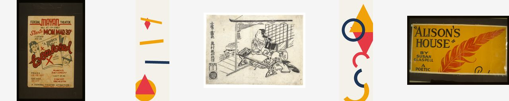

# Prototype 2 reference-image kit (frozen)

Five references, frozen for every M4 experiment. Sourcing rule (plan section C.1):
references come **only** from dataset v1's holdout split and from the project's own
seeded generator. No new external image was introduced, and dataset v1 was read,
never written.

The holdout split is used deliberately: those items are excluded from training by
construction, so when Prototypes 3-4 train LoRAs on the same data these reference
results remain uncontaminated.

## Provenance and licence

| id | category | origin | item | licence | dimensions | SHA-256 | committed |
|---|---|---|---|---|---|---|---|
| R1 | retro-poster | dataset-holdout | DS-0077 | public domain | 690x1024 | `515d83fc703f6bec...` | no |
| R2 | minimal-geometric | dataset-holdout | DS-0048 | project-original | 512x1536 | `af49e3fb28a0582b...` | yes |
| R3 | ukiyo-e | dataset-holdout | DS-0103 | CC0 | 4000x2980 | `cfbc213f291a0408...` | no |
| R4 | simple shape/layout transfer | generated | seed 9001 | project-original | 512x1536 | `45475315cf149fc3...` | yes |
| R5 | deliberately difficult | dataset-holdout | DS-0088 | public domain | 1024x699 | `65701fafa3b8c385...` | no |

Full SHA-256 values are in [`reference-kit.csv`](reference-kit.csv).

**Commit policy.** The two project-original references (R2, R4) are committed under
`data/references/`: they are tiny, licence-clean, and byte-reproducible from a seed.
The three externally sourced references (R1, R3, R5) are **not** committed, consistent
with the existing "raw images stay out of Git" policy; their manifest ID plus SHA-256
makes them re-derivable from `data/manifests/dataset-v1.csv`.

## Integrity verification

Each dataset-derived reference was checked against the manifest for split membership,
dimensions, licence, and SHA-256 of the actual file on disk.

| id | check |
|---|---|
| R1 | OK - DS-0077 holdout, SHA-256 matches manifest and file on disk |
| R2 | OK - DS-0048 holdout, SHA-256 matches manifest and file on disk |
| R3 | OK - DS-0103 holdout, SHA-256 matches manifest and file on disk |
| R4 | n/a - generated from seed, not a manifest item |
| R5 | OK - DS-0088 holdout, SHA-256 matches manifest and file on disk |

## img2img retained area after centre-crop

img2img forces the reference into the output resolution, so part of every reference
that does not already match the target aspect is discarded. This quantifies that cost
instead of describing it. **IP-Adapter does not crop to the output geometry** - it
passes the reference through a 224 px CLIP crop regardless of output size - so these
fractions apply to the img2img arm only.

| id | native | retained at 512x512 | retained at 512x1536 |
|---|---|---|---|
| R1 | 690x1024 | 67 % | 49 % |
| R2 | 512x1536 | 33 % | 100 % |
| R3 | 4000x2980 | 74 % | 25 % |
| R4 | 512x1536 | 33 % | 100 % |
| R5 | 1024x699 | 68 % | 23 % |

## Correction made after inspecting the images

All five references were opened and viewed before the condition table was written, rather
than described from the plan text. One label did not survive that check:

- The approved M4 plan describes condition **C5** as "reference says cresting wave, prompt
  says minimal geometric". *Cresting wave* is the wording of prompt **P3-ukiyo**, not the
  content of **R3**. R3 (`DS-0103`, `met-37129.jpg`) is a landscape ukiyo-e print of a seated
  figure at a low desk in an interior. The conflict C5 tests is real and unchanged - a
  figurative ukiyo-e scene against a minimal-geometric prompt - but it is now described
  accurately, and C3 is labelled *style-matched on style, subject-mismatched* rather than
  simply "style-matched".

A second observation, recorded so it is not mistaken for a property only R5 has: **R1 is also
a framed, text-dominated poster scan.** R5 remains the harder case because it adds landscape
orientation, which the deck format cannot accommodate - but frame and typography transfer can
and should be looked for in C1 as well as C6.

## Roles

- **R1** (retro-poster): verified by inspection: a portrait WPA theatre poster ('Federal Mayan Theatre'), photographed inside a dark frame and dominated by lettering. Style-matched to P1-poster, but it carries the same frame and typography properties as R5 - so R5 is the harder case by orientation, not by being the only framed or text-bearing reference (copied verbatim from data/raw/retro-poster/loc-98518996.jpg)
- **R2** (minimal-geometric): already 1:3; the only reference needing no crop at the deck format (copied verbatim from data/raw/minimal-geometric/geo-1047.png)
- **R3** (ukiyo-e): verified by inspection: a landscape ukiyo-e print of a seated figure at a low desk in an interior, on a wide off-white paper margin. NOT a cresting wave - that phrase belongs to prompt P3-ukiyo, not to this image. It is style-matched to P3-ukiyo and subject-mismatched, and it is the conflict reference in C5 (copied verbatim from data/raw/ukiyo-e/met-37129.jpg)
- **R4** (simple shape/layout transfer): unambiguous single subject and layout; the clean case for asking whether layout transfers independently of style (generated by ml/dataset/generate_geometric.py (seed=9001, palette_index=0, shape_count=6, version=1.0))
- **R5** (deliberately difficult): verified by inspection: a landscape WPA poster for "Alison's House", photographed in a dark frame, with large display lettering occupying most of the image. Landscape is the one orientation the deck format cannot accommodate, and framing plus typography are the two open M2 findings - all three stresses in one image (copied verbatim from data/raw/retro-poster/loc-98519423.jpg)

## Conditions built from this kit

| condition | reference | prompt | purpose |
|---|---|---|---|
| C1 | R1 | P1-poster | style-matched - reference and prompt are both retro-poster |
| C2 | R2 | P2-geo | style-matched; already at the deck aspect |
| C3 | R3 | P3-ukiyo | style-matched on style; subject differs (interior scene vs cresting wave) |
| C4 | R4 | P4-deck | layout transfer onto a different subject |
| C5 | R3 | P2-geo | CONFLICT - reference is a figurative ukiyo-e interior scene, prompt asks for minimal-geometric flat shapes |
| C6 | R5 | P1-poster | difficult - frames, typography, wrong orientation |

## Contact sheet

All five references at thumbnail size, so the kit is visible without the raw data.
